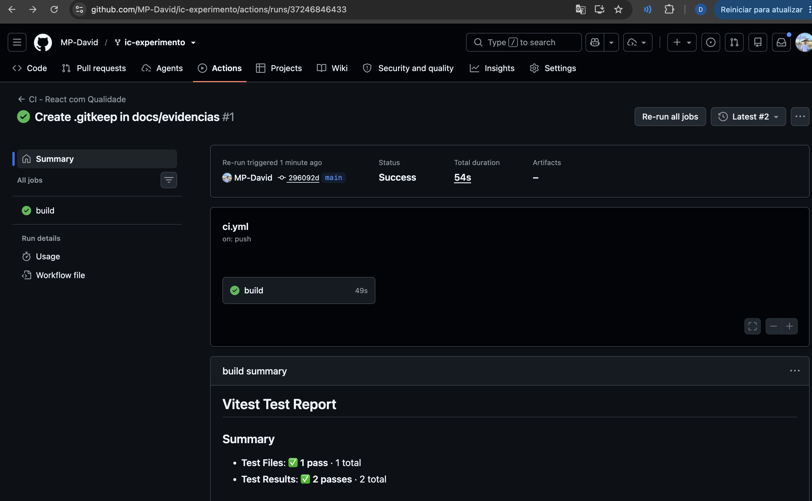
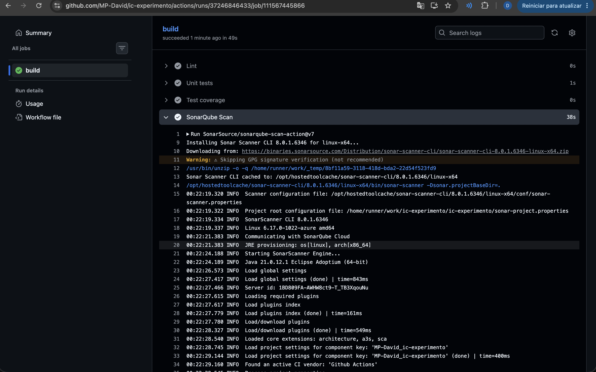
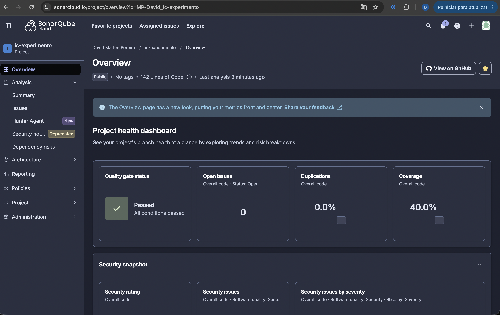

# Catálogo de Tecnologias — Qualidade no Pipeline

Projeto React/Vite usado na aula de **Qualidade de Software no Pipeline**. A aplicação possui uma lista com 30 tecnologias e uma busca por nome, categoria ou descrição.

## O que foi adicionado nesta versão

- ESLint com regras de qualidade (`no-unused-vars`, `no-console` e `eqeqeq`).
- Teste unitário com Vitest para a função de busca.
- Cobertura com `@vitest/coverage-v8`, gerando `coverage/lcov.info`.
- Integração com SonarQube por `SonarSource/sonarqube-scan-action@v7`.
- Pipeline: Checkout → Setup → Install → Lint → Test → Coverage → SonarQube → Build.

## Executar localmente

```bash
npm install
npm run dev
```

## Verificações de qualidade

```bash
npm run lint
npm test
npm run coverage
npm run build
```

## Teste unitário

A lógica da busca foi isolada em `src/search.js`. O arquivo `src/search.test.js` verifica, inicialmente, dois comportamentos:

1. busca por um termo (`react`);
2. busca vazia retorna a lista completa.

Isso permite que os alunos adicionem novos casos durante a aula, por exemplo: busca por categoria, descrição, termo inexistente e diferenças entre maiúsculas/minúsculas.

## ESLint

As regras ficam em `eslint.config.js`.

Exemplo:

```js
rules: {
  'no-unused-vars': 'error',
  'no-console': 'error',
  eqeqeq: 'error',
}
```

Para provocar uma falha no pipeline, adicione temporariamente um `console.log()` ao código ou declare uma variável sem utilizá-la.

## SonarQube Cloud

A análise estática é feita no **SonarQube Cloud** (sonarcloud.io), executada pelo GitHub Actions na etapa `SonarQube Scan`, logo após a geração da cobertura.

Configuração em `sonar-project.properties`:

```properties
sonar.organization=mp-david
sonar.projectKey=MP-David_ic-experimento
sonar.javascript.lcov.reportPaths=coverage/lcov.info
```

A cobertura é gerada pelo Vitest no formato LCOV (configurado em `vite.config.js`) e enviada ao SonarQube junto com a análise.

O token **não** está versionado: ele é lido do secret `SONAR_TOKEN` (Settings → Secrets and variables → Actions):

```yaml
- name: SonarQube Scan
  uses: SonarSource/sonarqube-scan-action@v7
  env:
    SONAR_TOKEN: ${{ secrets.SONAR_TOKEN }}
```

> Para a análise via CI funcionar, a *Automatic Analysis* deve estar desativada no SonarQube Cloud (Administration → Analysis Method).

## Pipeline

```text
Checkout
   ↓
Setup Node.js
   ↓
Install
   ↓
Lint
   ↓
Unit tests
   ↓
Coverage
   ↓
SonarQube Scan
   ↓
Build
```

## Evidências da análise de qualidade

### Pipeline



### SonarQube



### Quality Gate


